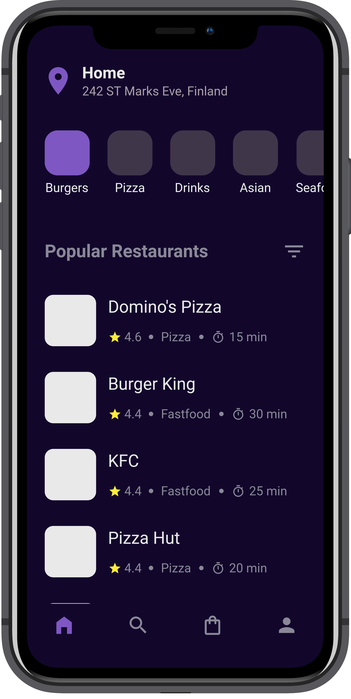

# :beginner: Food App UI

Responsive food app UI.

## :book: Table of contents

- [General info](#general-info)
- [Technologies](#technologies)
- [Screenshots](#screenshots)
- [Setup](#setup)

## :pencil: General info

Food app UI with a great emphasis over an app's responsiveness.

## :gear: Technologies

Project is created with:

- [Flutter](https://flutter.dev/) version: 2.0.1
- [Dart](https://dart.dev/) version: 2.12.0
- [Font_awesome_flutter](https://pub.dev/packages/font_awesome_flutter) version: 9.0.0
- [Hexcolor](https://pub.dev/packages/hexcolor) version: 1.0.6
- [Lint](https://pub.dev/packages/lint) version: 1.3.0
- [Device_preview](https://pub.dev/packages/device_preview) version: 0.7.1

## :camera_flash: Screenshots

 

## :computer: Setup

To run this project follow these steps:

1. Clone the repository

```
$ git clone https://github.com/kubacarbon/food-app-ui.git
```

2. Open the project

```
$ cd food-app-ui
```

3. Install dependencies

```
flutter pub get
```

4. Run app

```
$ flutter run
```
